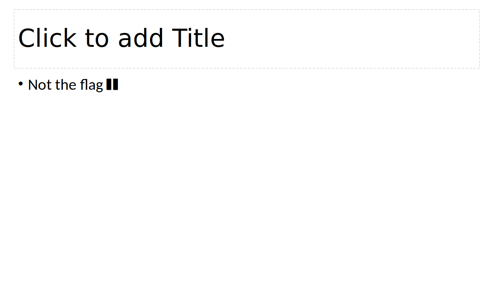

# [MacroHard WeakEdge](https://play.picoctf.org/practice/challenge/130)

## Overview

**Points**: 60

**Category**: [Forensics](../)

## Description

I've hidden a flag in this file. Can you find it? [Forensics is fun.pptm](./Forensics is fun.pptm)

## Hints

None

## Solution

Open the file in PowerPoint. First, try scrolling through the slides. Slide 37 looks interesting, but there's no flag there.



Based on the title, we can try looking at the macros. Go to `View` > `Macros`. There's a macro called `Module1`. However, this just has a function that also doesn't have the flag.

```vb
Rem Attribute VBA_ModuleType=VBAModule
Sub Module1
Rem Sub not_flag()
Rem     Dim not_flag As String
Rem     not_flag = "sorry_but_this_isn't_it"
Rem End Sub
Rem 
End Sub
```
Finally, since PowerPoint files are just zip files, we can try to use the `binwalk` tool to find any hidden files.

```bash
❯ binwalk 'Forensics is fun.pptm'

DECIMAL       HEXADECIMAL     DESCRIPTION
--------------------------------------------------------------------------------
0             0x0             Zip archive data, at least v2.0 to extract, compressed size: 674, uncompressed size: 10660, name: [Content_Types].xml
1243          0x4DB           Zip archive data, at least v2.0 to extract, compressed size: 259, uncompressed size: 738, name: _rels/.rels
...
88548         0x159E4         Zip archive data, at least v2.0 to extract, compressed size: 81, uncompressed size: 99, name: ppt/slideMasters/hidden
100071        0x186E7         End of Zip archive, footer length: 22
```
Notice how there's a file called `ppt/slideMasters/hidden`. Use the `-e` flag to extract the files.

```bash
❯ binwalk -e 'Forensics is fun.pptm'
```

Navigate to `ppt/slideMasters/hidden` and we find the following string.

```
Z m x h Z z o g c G l j b 0 N U R n t E M W R f d V 9 r b j B 3 X 3 B w d H N f c l 9 6 M X A 1 f Q
```

After using a base64 decoder, we get the flag.

```bash
❯ echo 'ZmxhZzogcGljb0NURntEMWRfdV9rbjB3X3BwdHNfcl96MXA1fQ' | base64 -d
flag: picoCTF{D1d_u_kn0w_ppts_r_z1p5}base64: invalid input
```

## Flag

`picoCTF{D1d_u_kn0w_ppts_r_z1p5}`