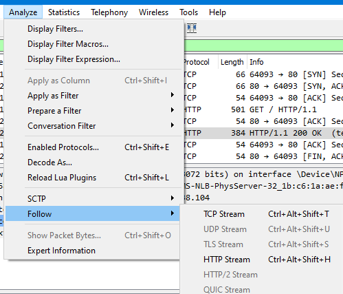
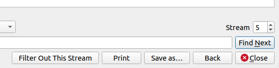

# [Wireshark doo dooo do doo...](https://play.picoctf.org/practice/challenge/115)

## Overview

**Points**: 50

**Category**: [Forensics](../)

## Description

Can you find the flag? [shark1.pcapng](./shark1.pcapng).

## Hints

None

## Solution

Open the pcap in WireShark and follow the TCP stream. 

Switch to stream 5.

You'll see something that looks like the flag. Use rot13 to decode it.

> Gur synt vf cvpbPGS{c33xno00_1_f33_h_qrnqorrs}

## Flag

`picoCTF{p33kab00_1_s33_u_deadbeef}`