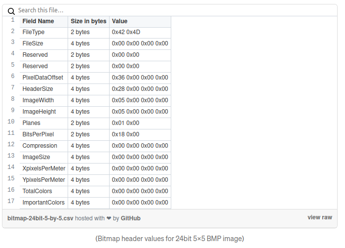

# [tunn3l v1s10n](https://play.picoctf.org/practice/challenge/112?page=2)

## Overview

**Points**: 40

**Category**: [Forensics](../)

## Description

We found this [file](./tunn3l\_v1s10n). Recover the flag.

## Hints

1. Weird that it won't display right...

## Solution

> I highly recommend this article to understand the BMP file structure. https://medium.com/sysf/bits-to-bitmaps-a-simple-walkthrough-of-bmp-image-format-765dc6857393

Open the file in a hex editor. Notice how the header of the file starts with `42 4D`. We can also see `BM` written at the beginning of the file. 
Using the [file signatures](https://www.garykessler.net/library/file_sigs.html) website, we see that this is a BMP file. 
> Note: You can also run `exiftool` to the file to figure out the image type and other details.

After changing the extension of the file to `tunn3l_v1s10n.bmp`, the file does not open in the photo editor. But if you look closely, the file has some BAD values in it.

After looking at [this article](https://medium.com/sysf/bits-to-bitmaps-a-simple-walkthrough-of-bmp-image-format-765dc6857393) or the [wikipedia page](https://en.wikipedia.org/wiki/BMP_file_format), we can see that the first BAD value is the position of the pixel data offset, and the second BAD value is the header size. (Remember that each 2-character value in a hex editor represents a byte).

Since the pixel data offset and the header size should be standard for each bitmap, we can open any other bitmap and copy those values.

However, opening the image shows a fake flag, which means we need to do some more digging.

If we run `exiftool tunn3l_v1s10n.bmp`, notice how there's a difference between the actual length of the image and the image size, which means that the file size is bigger than what is being displayed. To fix this, we can adjust the height or width of the image. 

Since `0x18` is `24` bits per pixel, we have `24 / 8 = 3` bytes per pixel (from the bitmap example above). Therefore, there are `2893400 / 3 = 964466` bytes, but the image size is `1134 x 306 = 347004`. Adjusting the width distorts the image, so we can adjust the height to get `964466 / 1134 ~= 850`, which is `0x352` in hex.

Since the byte order of BMP is in little endian, we can fix the file by putting in `52, 03` for the image length.

## Flag

`picoCTF{qu1t3_a_v13w_2020}`