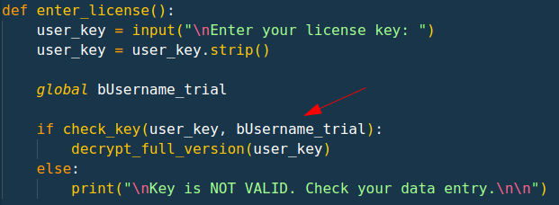

# [keygenme-py](https://play.picoctf.org/practice/challenge/121)

## Overview

**Points**: 30

**Category**: [Reverse Engineering](../)

## Description

[keygenme-trial.py](./keygenme-trial.py)

## Hints

None

## Solution

The beginning and end of the flag is given in the `key_part_static` variables, but we need to decrypt the middle portion:

```py
key_part_static1_trial = "picoCTF{1n_7h3_|<3y_of_"
key_part_dynamic1_trial = "xxxxxxxx"
key_part_static2_trial = "}"
key_full_template_trial = key_part_static1_trial + \
    key_part_dynamic1_trial + key_part_static2_trial
```

To unlock the full version of the program, we need to enter the license key, or in other words the CTF flag. Looking at the code, we can see that the `enter_license()` function compares the key we enter to a variable called `bUsername_trial`.



Looking at the code at the beginning of the file, we see that `bUsername_trial = b"MORTON"`. We can now use this to decrypt the flag.

The `check_key()` function uses a hash to compare the dynamic part of the key. We can reverse engineer this by using `b"MORTON"` to figure out the key.

```py
>>> import hashlib
>>> from cryptography.fernet import Fernet
>>> import base64
>>> username_trial = b"MORTON"
>>> hashlib.sha256(username_trial).hexdigest()[4]
'7'
>>> hashlib.sha256(username_trial).hexdigest()[5]
'5'
... # Do this with all the parts of the hash
>>> hashlib.sha256(username_trial).hexdigest()[8]
'1'
>>>
```

At the end, simply replace the `xxxxx` in the flag with the characters that you got from decrypting the hash.

## Flag

`picoCTF{1n_7h3_|<3y_of_75fc1081}`