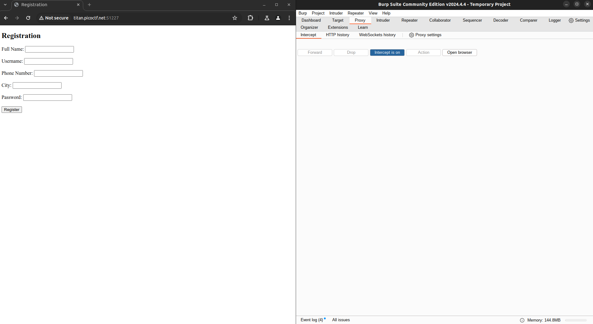
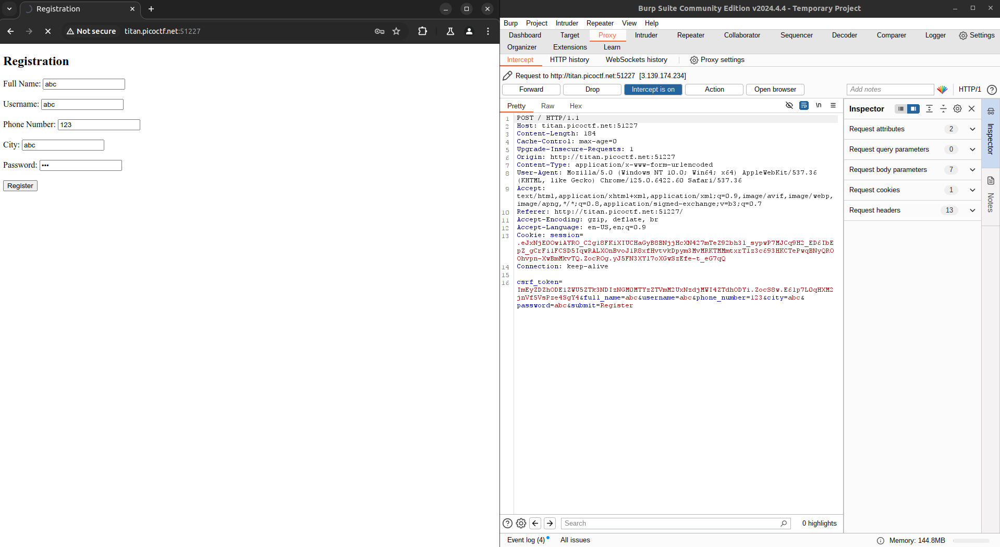
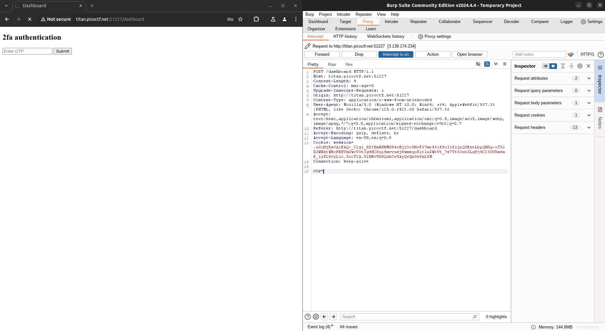
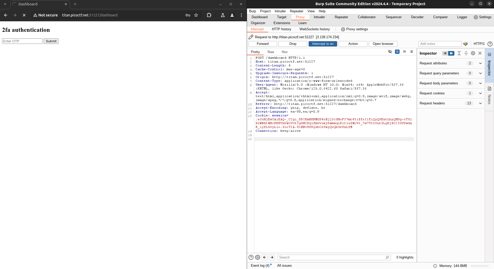

# [IntroToBurp](https://play.picoctf.org/practice/challenge/419)

## Overview

**Category**: [Web Exploitation](../)

**Difficulty**: Easy

**Event**: picoCTF 2024

## Description

Try [here](http://titan.picoctf.net:51227/) to find the flag

## Hints

1. Try using burpsuite to intercept request to capture the flag.
2. Try mangling the request, maybe their server-side code doesn't handle
malformed requests very well.

## Solution

The idea is to bypass the OTP verification by intercepting the request and deleting the OTP check.

Open the URL in BurpSuite, switch the tab to Proxy and turn Intercept On.

Fill in the registration form and click Register. The request will be intercepted by BurpSuite.

Click "Forward" to send the request to the server (you may have to click "Forward" more than once). The server will load the OTP page.

Press Submit, then intercept the request again. Delete the `otp` parameter and click "Forward".

The server will respond with the flag.

## Flag

`picoCTF{#0TP_Bypvss_SuCc3$S_2e80f1fd}`