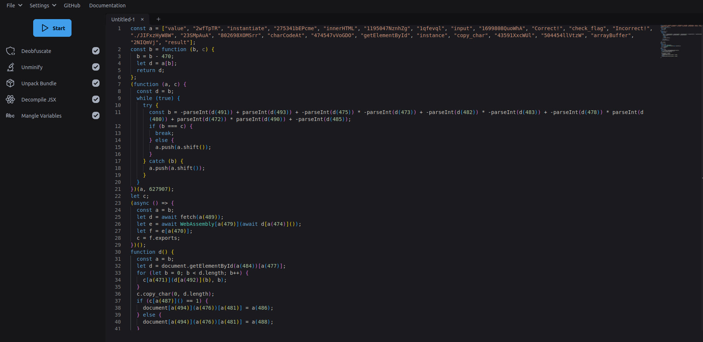

# [Some Assembly Required 1](https://play.picoctf.org/practice/challenge/152)

## Overview

**Points**: 70

**Category**: [Web Exploitation](../)

## Description

<http://mercury.picoctf.net:1896/index.html>

## Hints

None

## Solution

The website compares our input to the flag, and returns "Correct" if they match. 

After inspecting the source code, we see that that it links to a script called `G82XCw5CX3.js`. This script contains obfuscated code.

```javascript
const _0x402c=['value','2wfTpTR','instantiate','275341bEPcme','innerHTML','1195047NznhZg','1qfevql','input','1699808QuoWhA','Correct!','check_flag','Incorrect!','./JIFxzHyW8W','23SMpAuA','802698XOMSrr','charCodeAt','474547vVoGDO','getElementById','instance','copy_char','43591XxcWUl','504454llVtzW','arrayBuffer','2NIQmVj','result'];const _0x4e0e=function(_0x553839,_0x53c021){_0x553839=_0x553839-0x1d6;let _0x402c6f=_0x402c[_0x553839];return _0x402c6f;};(function(_0x76dd13,_0x3dfcae){const _0x371ac6=_0x4e0e;while(!![]){try{const _0x478583=-parseInt(_0x371ac6(0x1eb))+parseInt(_0x371ac6(0x1ed))+-parseInt(_0x371ac6(0x1db))*-parseInt(_0x371ac6(0x1d9))+-parseInt(_0x371ac6(0x1e2))*-parseInt(_0x371ac6(0x1e3))+-parseInt(_0x371ac6(0x1de))*parseInt(_0x371ac6(0x1e0))+parseInt(_0x371ac6(0x1d8))*parseInt(_0x371ac6(0x1ea))+-parseInt(_0x371ac6(0x1e5));if(_0x478583===_0x3dfcae)break;else _0x76dd13['push'](_0x76dd13['shift']());}catch(_0x41d31a){_0x76dd13['push'](_0x76dd13['shift']());}}}(_0x402c,0x994c3));let exports;(async()=>{const _0x48c3be=_0x4e0e;let _0x5f0229=await fetch(_0x48c3be(0x1e9)),_0x1d99e9=await WebAssembly[_0x48c3be(0x1df)](await _0x5f0229[_0x48c3be(0x1da)]()),_0x1f8628=_0x1d99e9[_0x48c3be(0x1d6)];exports=_0x1f8628['exports'];})();function onButtonPress(){const _0xa80748=_0x4e0e;let _0x3761f8=document['getElementById'](_0xa80748(0x1e4))[_0xa80748(0x1dd)];for(let _0x16c626=0x0;_0x16c626<_0x3761f8['length'];_0x16c626++){exports[_0xa80748(0x1d7)](_0x3761f8[_0xa80748(0x1ec)](_0x16c626),_0x16c626);}exports['copy_char'](0x0,_0x3761f8['length']),exports[_0xa80748(0x1e7)]()==0x1?document[_0xa80748(0x1ee)](_0xa80748(0x1dc))[_0xa80748(0x1e1)]=_0xa80748(0x1e6):document[_0xa80748(0x1ee)](_0xa80748(0x1dc))[_0xa80748(0x1e1)]=_0xa80748(0x1e8);}
```

Use a [JavaScript deobfuscator](https://webcrack.netlify.app/) to deobfuscate the code:



The deobfuscated code is as follows:
```javascript
const a = ["value", "2wfTpTR", "instantiate", "275341bEPcme", "innerHTML", "1195047NznhZg", "1qfevql", "input", "1699808QuoWhA", "Correct!", "check_flag", "Incorrect!", "./JIFxzHyW8W", "23SMpAuA", "802698XOMSrr", "charCodeAt", "474547vVoGDO", "getElementById", "instance", "copy_char", "43591XxcWUl", "504454llVtzW", "arrayBuffer", "2NIQmVj", "result"];
const b = function (b, c) {
  b = b - 470;
  let d = a[b];
  return d;
};
(function (a, c) {
  const d = b;
  while (true) {
    try {
      const b = -parseInt(d(491)) + parseInt(d(493)) + -parseInt(d(475)) * -parseInt(d(473)) + -parseInt(d(482)) * -parseInt(d(483)) + -parseInt(d(478)) * parseInt(d(480)) + parseInt(d(472)) * parseInt(d(490)) + -parseInt(d(485));
      if (b === c) {
        break;
      } else {
        a.push(a.shift());
      }
    } catch (b) {
      a.push(a.shift());
    }
  }
})(a, 627907);
let c;
(async () => {
  const a = b;
  let d = await fetch(a(489));
  let e = await WebAssembly[a(479)](await d[a(474)]());
  let f = e[a(470)];
  exports = f.exports;
})();
function onButtonPress() {
  const a = b;
  let d = document.getElementById(a(484))[a(477)];
  for (let b = 0; b < d.length; b++) {
    exports[a(471)](d[a(492)](b), b);
  }
  exports.copy_char(0, d.length);
  if (exports[a(487)]() == 1) {
    document[a(494)](a(476))[a(481)] = a(486);
  } else {
    document[a(494)](a(476))[a(481)] = a(488);
  }
}
```

We can see the top part of the code has an array `a`, a function `b`, and then it calls a new function with the array `a` and the number `627907`. If we run this code, we see that it shuffles the array `a`.

```javascript
const a = ["value", "2wfTpTR", "instantiate", "275341bEPcme", "innerHTML", "1195047NznhZg", "1qfevql", "input", "1699808QuoWhA", "Correct!", "check_flag", "Incorrect!", "./JIFxzHyW8W", "23SMpAuA", "802698XOMSrr", "charCodeAt", "474547vVoGDO", "getElementById", "instance", "copy_char", "43591XxcWUl", "504454llVtzW", "arrayBuffer", "2NIQmVj", "result"];
const b = function (b, c) {
  b = b - 470;
  let d = a[b];
  return d;
};
(function (a, c) {
  const d = b;
  while (true) {
    try {
      const b = -parseInt(d(491)) + parseInt(d(493)) + -parseInt(d(475)) * -parseInt(d(473)) + -parseInt(d(482)) * -parseInt(d(483)) + -parseInt(d(478)) * parseInt(d(480)) + parseInt(d(472)) * parseInt(d(490)) + -parseInt(d(485));
      if (b === c) {
        break;
      } else {
        a.push(a.shift());
      }
    } catch (b) {
      a.push(a.shift());
    }
  }
})(a, 627907);

>>> console.log(a);
[
  'instance',       'copy_char',
  '43591XxcWUl',    '504454llVtzW',
  'arrayBuffer',    '2NIQmVj',
  'result',         'value',
  '2wfTpTR',        'instantiate',
  '275341bEPcme',   'innerHTML',
  '1195047NznhZg',  '1qfevql',
  'input',          '1699808QuoWhA',
  'Correct!',       'check_flag',
  'Incorrect!',     './JIFxzHyW8W',
  '23SMpAuA',       '802698XOMSrr',
  'charCodeAt',     '474547vVoGDO',
  'getElementById'
]
```

Now, we can use this new array to replace the function calls i.e. `a(404)`.

```javascript
let c;
(async () => {
  const a = b;
  let d = await fetch('./JIFxzHyW8W');
  let e = await WebAssembly['instantiate'](await d['arrayBuffer']());
  let f = e['instance'];
  exports = f.exports;
})();
function onButtonPress() {
  const a = b;
  let d = document.getElementById('input')['value'];
  for (let b = 0; b < d.length; b++) {
    exports['copy_char'](d['charCodeAt'](b), b);
  }
  exports.copy_char(0, d.length);
  if (exports['check_flag']() == 1) {
    document['getElementById']('result')['innerHTML'] = 'Correct!';
  } else {
    document['getElementById']('result')['innerHTML'] = 'Incorrect!';
  }
}
```

Notice how the function `onButtonPress()` calls `exports['check_flag']()`, which tells us that the `check_flag` is an exported function.

Above, we can see that `exports` is assigned to `f.exports`, where `f` is the instance of the WebAssembly module. This means that `check_flag` is a function from the WebAssembly module.

The async function makes a fetch request to `./JIFxzHyW8W`, which is probably where the WebAssembly module is. 

So, we can get the WebAssembly module by visiting the URL `http://mercury.picoctf.net:1896/JIFxzHyW8W` or running:

```bash
wget http://mercury.picoctf.net:1896/JIFxzHyW8W
```

To confirm, it is a WebAssembly module.

```bash
$ file JIFxzHyW8W
JIFxzHyW8W: WebAssembly (wasm) binary module version 0x1 (MVP)
```

WebAssembly has a binary format and a text format. We can decompile the WebAssembly module to a text format using `wasm2wat` locally from the [WebAssembly Toolkit](https://github.com/WebAssembly/wabt) or from the online version [wasm2wat](https://webassembly.github.io/wabt/demo/wasm2wat/).

```bash
wasm2wat JIFxzHyW8W -o JIFxzHyW8W.wat
```

The flag is at the bottom of the `JIFxzHyW8W.wat` file.

```wat
(data (;0;) (i32.const 1024) "picoCTF{a2843c6ba4157dc1bc052818a6242c3f}\00\00"))
```

Alternatively, you could just run `strings` on the binary.

```bash
$ strings JIFxzHyW8W | grep picoCTF
picoCTF{a2843c6ba4157dc1bc052818a6242c3f}
```

## Flag

`picoCTF{a2843c6ba4157dc1bc052818a6242c3f}`