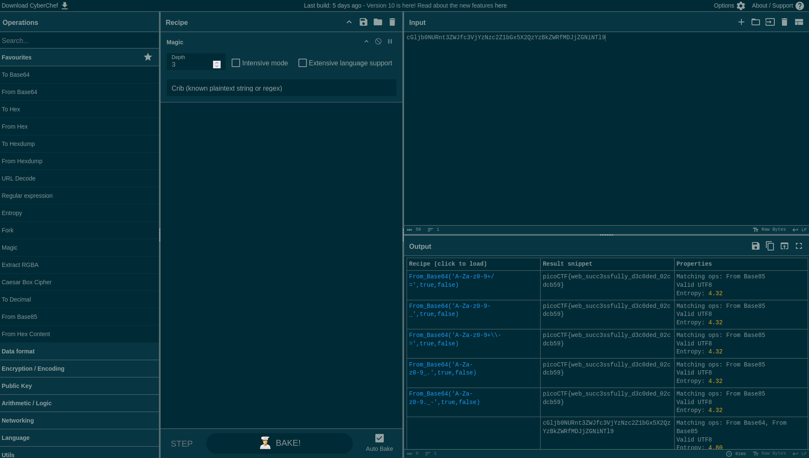

# [WebDecode](https://play.picoctf.org/practice/challenge/427)

## Overview

**Points**: 50

**Category**: [Web Exploitation](../)

## Description

Do you know how to use the web inspector?
Start searching [here](http://titan.picoctf.net:<port>/) to find the flag

## Hints

1. Use the web inspector on other files included by the web page.
2. The flag may or may not be encoded

## Solution

Navigate the website and open the web inspector. You can see that the `about.html` page says "Try inspecting the page!! You might find it there".

Nothing seems unusual, except in the `section` html tag:

```html
<section class="about" notify_true="cGljb0NURnt3ZWJfc3VjYzNzc2Z1bGx5X2QzYzBkZWRfMDJjZGNiNTl9">
```

After putting `cGljb0NURnt3ZWJfc3VjYzNzc2Z1bGx5X2QzYzBkZWRfMDJjZGNiNTl9` into [CyberChef](https://gchq.github.io/CyberChef/), we see that it is base64 encoded. Decoding it gives the flag.



## Flag

`picoCTF{web_succ3ssfully_d3c0ded_02cdcb59}`
